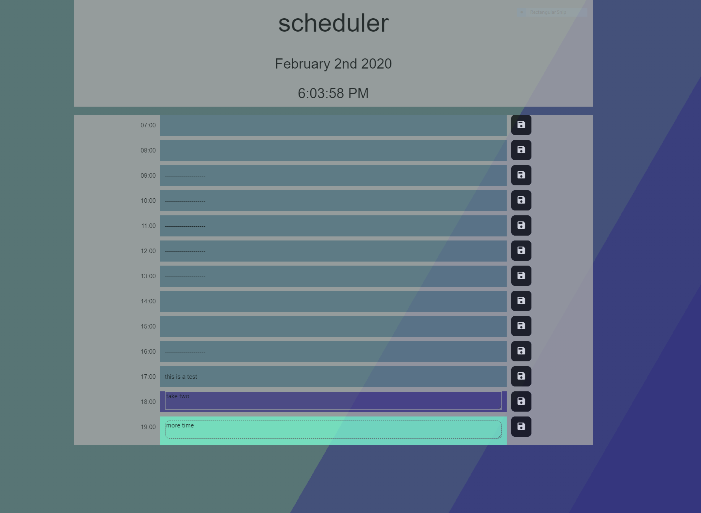

# Calendar-App

Github pages link [here](https://trav-xeno.github.io/Calendar-App/).

This is a one day scheduler app.
This project uses Jquery, javascript dates and momentJs.
The calender cells do not dynamically update based on time while teh user is on the page but rather on every load.
The data is stored in local storage and only gets cleared on the first load of next day.

## Javascript

You will notice there are a few files vue.js, moment.js, tt.js, and main.js. tt.js was me rewriting the app using jquery.
The fully working and final version of the code should be in main.js.
If you are wondering why I went from a vuejs app to then rewriting the whole app in Jquery, well it was mainly easier to go from idea to testing.
Vue.js has lots of things that I still have to learn so for the purpose of the app I finished it in Jquery.
Also I rewrote this starting saturday so this whole thing took me twoish days (certainly not the best choice).

## CSS

you will see a scss file that I created while trying to mess around with button animations.
style.css is the main css file for the app. I found some information online about making a on hover animated button with moving borders and went with that for the style.

## snapshot

